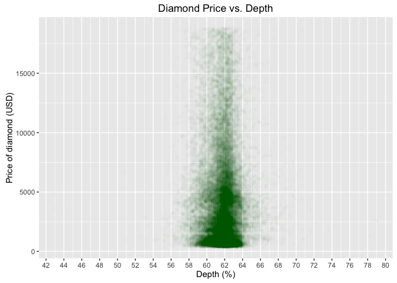

# Diamonds Analysis Pt 2
# Load the data and libraries

```r
library(ggplot2)
```

```
## Warning: package 'ggplot2' was built under R version 3.1.3
```

```r
library(dplyr)
```

```
## Warning: package 'dplyr' was built under R version 3.1.3
```

```
## 
## Attaching package: 'dplyr'
```

```
## The following objects are masked from 'package:stats':
## 
##     filter, lag
```

```
## The following objects are masked from 'package:base':
## 
##     intersect, setdiff, setequal, union
```

```r
library(tidyr)
```

```
## Warning: package 'tidyr' was built under R version 3.1.3
```

```r
data("diamonds")
```

# Your first task is to create a scatterplot of price vs x, y, or z using the ggplot syntax.

```r
ggplot(aes(x = x, y = price), data = diamonds) + geom_point(alpha = 1/20) + 
  xlim(3.5,9.5) + 
  labs(title = "Diamond Price vs. Length", x = "Length of diamond (mm)",
  y = "Price of diamond (USD)")
```

```
## Warning: Removed 20 rows containing missing values (geom_point).
```

<!-- -->

```r
ggplot(aes(x = y, y = price), data = diamonds) + geom_point(alpha = 1/20, color = "blue") + 
  xlim(3.5,10) + 
  labs(title = "Diamond Price vs. Width", x = "Width of diamond (mm)",
       y = "Price of diamond (USD)")
```

```
## Warning: Removed 12 rows containing missing values (geom_point).
```

<!-- -->

```r
ggplot(aes(x = z, y = price), data = diamonds) + geom_point(alpha = 1/20, color = "red") + 
  xlim(1,7.5) +
  labs(title = "Diamond Price vs. Height", x = "Height of diamond (mm)",
       y = "Price of diamond (USD)")
```

```
## Warning: Removed 22 rows containing missing values (geom_point).
```

<!-- -->

# What is the correlation between price and each of X, Y, and Z?

```r
cor(diamonds$x, diamonds$price)
```

```
## [1] 0.8844352
```

```r
cor(diamonds$y, diamonds$price)
```

```
## [1] 0.8654209
```

```r
cor(diamonds$z, diamonds$price)
```

```
## [1] 0.8612494
```

# Create a simple scatter plot of price vs depth.

```r
ggplot(aes(x = depth, y = price), data = diamonds) + geom_point() + 
  labs(title = "Diamond Price vs. Depth", x = "Depth (%)",
       y = "Price of diamond (USD)")
```

<!-- -->

# Change the code to make the transparency of the points to be 1/100 of what they are now and mark the x-axis every 2 units.

```r
ggplot(aes(x = depth, y = price), data = diamonds) + geom_point(alpha = 1/100, color = "green4") + 
  scale_x_continuous(breaks = seq(0, 100, 2)) + 
  labs(title = "Diamond Price vs. Depth", x = "Depth (%)",
       y = "Price of diamond (USD)")
```

<!-- -->

# What is the correlation between price and depth? Would you use this as a predictor?

```r
cor(diamonds$depth, diamonds$price)
```

```
## [1] -0.0106474
```

###*No, the correlation is almost 0*


# Create a scatterplot of price vs carat and omit the top 1% of price and carat values.

```r
ggplot(aes(x = carat, y = price), data = diamonds) + geom_point(alpha = 1/50) + 
  xlim(0, quantile(diamonds$carat, 0.99)) +
  ylim(0, quantile(diamonds$price, 0.99)) +
  labs(title = "Diamond Price vs. Carat", x = "Carat",
       y = "Price of diamond (USD)")
```

```
## Warning: Removed 926 rows containing missing values (geom_point).
```

<!-- -->

# Create a scatterplot of price vs. volume (x * y * z).

```r
ggplot(aes(x = x*y*z, y = price), data = diamonds) + geom_point(alpha = 1/30) +  
  xlim(0, 600) +
  labs(title = "Diamond Price vs. Volume", x = "Diamond Volume (mm^3)",
       y = "Price of diamond (USD)")
```

```
## Warning: Removed 9 rows containing missing values (geom_point).
```

<!-- -->

# What is the correlation between price and volume?

```r
diamonds$diamonds_volume <- diamonds$x * diamonds$y * diamonds$z
cor(diamonds$diamonds_volume, diamonds$price)
```

```
## [1] 0.9023845
```

###*About 90%*


# Subset the data to exclude diamonds with a volume greater than or equal to 800. Also, exclude diamonds with a volume of 0. Adjust the transparency of the points and add a linear model to the plot.

```r
ggplot(aes(x = diamonds_volume, y = price), data = diamonds[diamonds$diamonds_volume < 800 & diamonds$diamonds_volume > 0]) + 
  geom_point(alpha = 1/30) +  
  xlim(0, 600) +
  labs(title = "Diamond Price vs. Volume", x = "Diamond Volume (mm^3)",
       y = "Price of diamond (USD)")
```

```
## Warning: Removed 9 rows containing missing values (geom_point).
```

<!-- -->

# Do you think this would be a useful model to estimate the price of diamonds? Why or why not?

###*Yes the correlation is ~90%*


# Use the function dplyr package to create a new data frame containing info on diamonds by clarity. Name the data frame diamondsByClarity. The data frame should contain the following variables in this order.
       (1) mean_price
       (2) median_price
       (3) min_price
       (4) max_price
       (5) n where n is the number of diamonds in each level of clarity.

### Subset the data for price and clarity

```r
diamondsByClarity <- diamonds %>% select(price, clarity)
```

### Summarize descriptive statistics by price or clarity

```r
diamondsByClarity2 <- diamondsByClarity %>% group_by(clarity) %>%
                      summarise(mean_price = mean(price), median_price = median(price), 
                          min_price = min(price), max_price = max(price), n = n())

print(diamondsByClarity2)
```

```
## Source: local data frame [8 x 6]
## 
##   clarity mean_price median_price min_price max_price     n
##    (fctr)      (dbl)        (dbl)     (int)     (int) (int)
## 1      I1   3924.169         3344       345     18531   741
## 2     SI2   5063.029         4072       326     18804  9194
## 3     SI1   3996.001         2822       326     18818 13065
## 4     VS2   3924.989         2054       334     18823 12258
## 5     VS1   3839.455         2005       327     18795  8171
## 6    VVS2   3283.737         1311       336     18768  5066
## 7    VVS1   2523.115         1093       336     18777  3655
## 8      IF   2864.839         1080       369     18806  1790
```
