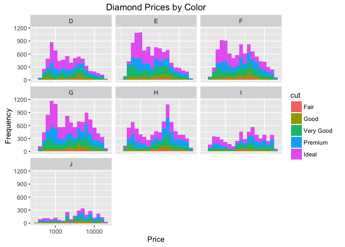

# Diamonds Analysis Pt 3
### Load the data and libraries

```r
library(ggplot2)
```

```
## Warning: package 'ggplot2' was built under R version 3.1.3
```

```r
library(dplyr)
```

```
## Warning: package 'dplyr' was built under R version 3.1.3
```

```
## 
## Attaching package: 'dplyr'
```

```
## The following objects are masked from 'package:stats':
## 
##     filter, lag
```

```
## The following objects are masked from 'package:base':
## 
##     intersect, setdiff, setequal, union
```

```r
library(tidyr)
```

```
## Warning: package 'tidyr' was built under R version 3.1.3
```

```r
data("diamonds")
```

### Create a histogram of diamond prices. Facet the histogram by diamond color and use cut to color the histogram bars

```r
ggplot(aes(x = price, fill = cut), data = diamonds) + geom_histogram(binwidth = .1) + 
  facet_wrap(~color) + labs(title = "Diamond Prices by Color", x = "Price", y = "Frequency") + 
  scale_x_log10()
```



### Create a scatterplot of diamond price vs.table and color the points by the cut of the diamond.

```r
ggplot(aes(x = table, y = price, color = cut), data = diamonds) + 
  geom_point(position=position_jitter()) + 
  labs(title = "Diamond Prices by Table", x = "Table", y = "Price")
```


#### What is the typical table range for the ideal cut?
55-57

##### What is the typical table range for the premium cut?
58-62

### Create a scatterplot of diamond price vs. volume (x * y * z) and color the points by the clarity of diamonds. Use scale on the y-axis to take the log10 of price. You should also omit the top 1% of diamond volumes from the plot.


```r
diamondsVolume = filter(diamonds, x*y*z > 0, x*y*z <= quantile(x*y*z, 0.99))

ggplot(aes(x = x*y*z, y = price, color = clarity), 
       data = diamondsVolume) + geom_point() +  
  scale_y_log10() + xlim(0,400) +
  labs(title = "Diamond Price vs. Volume", x = "Diamond Volume (mm^3)",
       y = "Price of diamond (USD)")
```


