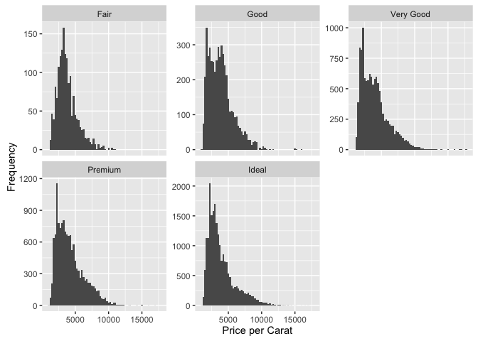

# Diamonds Analysis


```r
#Load libraries and data
library(ggplot2)
```

```
## Warning: package 'ggplot2' was built under R version 3.1.3
```

```r
data("diamonds")

# Create a histogram of the price of
# all the diamonds in the diamond data set.
hist(diamonds$price, xlab = "price")
```

<!-- -->

```r
summary(diamonds$price)
```

```
##    Min. 1st Qu.  Median    Mean 3rd Qu.    Max. 
##     326     950    2401    3933    5324   18820
```

```r
#Plot histogram of diamond prices
ggplot(data = diamonds, aes(x = price)) + 
  geom_histogram(binwidth = 250) + 
  scale_x_continuous() + xlab('Price') + 
  ylab('Frequency')
```

<!-- -->

```r
#Plot histogram of diamond prices by cut
by(diamonds$price, diamonds$cut, summary)
```

```
## diamonds$cut: Fair
##    Min. 1st Qu.  Median    Mean 3rd Qu.    Max. 
##     337    2050    3282    4359    5206   18570 
## -------------------------------------------------------- 
## diamonds$cut: Good
##    Min. 1st Qu.  Median    Mean 3rd Qu.    Max. 
##     327    1145    3050    3929    5028   18790 
## -------------------------------------------------------- 
## diamonds$cut: Very Good
##    Min. 1st Qu.  Median    Mean 3rd Qu.    Max. 
##     336     912    2648    3982    5373   18820 
## -------------------------------------------------------- 
## diamonds$cut: Premium
##    Min. 1st Qu.  Median    Mean 3rd Qu.    Max. 
##     326    1046    3185    4584    6296   18820 
## -------------------------------------------------------- 
## diamonds$cut: Ideal
##    Min. 1st Qu.  Median    Mean 3rd Qu.    Max. 
##     326     878    1810    3458    4678   18810
```

```r
ggplot(data = diamonds, aes(x = price)) + 
  geom_histogram(binwidth = 250) + 
  facet_wrap(~cut, scales = "free_y") + 
  scale_x_continuous() + xlab('Price') + 
  ylab('Frequency')
```

<!-- -->

```r
#Plot histogram of diamond prices by carat
diamonds$price_per_carat <- diamonds$price / diamonds$carat

ggplot(data = diamonds, aes(x = price_per_carat)) + 
  geom_histogram(binwidth = 250) + 
  facet_wrap(~cut, scales = "free_y") + 
  xlab('Price per Carat') + 
  ylab('Frequency')
```

<!-- -->

```r
# Adjust the bin width and transform the scale
# of the x-axis using log10.
ggplot(data = diamonds, aes(x = log10(price_per_carat))) + 
  geom_histogram(binwidth = 0.05) + 
  facet_wrap(~cut, scales = "free_y") + 
  xlab('Price per Carat') + 
  ylab('Frequency')
```

<!-- -->

```r
# Investigate the price of diamonds using box plots,
# numerical summaries, and one of the following categorical
# variables: cut, clarity, or color.
by(diamonds$price, diamonds$color, summary)
```

```
## diamonds$color: D
##    Min. 1st Qu.  Median    Mean 3rd Qu.    Max. 
##     357     911    1838    3170    4214   18690 
## -------------------------------------------------------- 
## diamonds$color: E
##    Min. 1st Qu.  Median    Mean 3rd Qu.    Max. 
##     326     882    1739    3077    4003   18730 
## -------------------------------------------------------- 
## diamonds$color: F
##    Min. 1st Qu.  Median    Mean 3rd Qu.    Max. 
##     342     982    2344    3725    4868   18790 
## -------------------------------------------------------- 
## diamonds$color: G
##    Min. 1st Qu.  Median    Mean 3rd Qu.    Max. 
##     354     931    2242    3999    6048   18820 
## -------------------------------------------------------- 
## diamonds$color: H
##    Min. 1st Qu.  Median    Mean 3rd Qu.    Max. 
##     337     984    3460    4487    5980   18800 
## -------------------------------------------------------- 
## diamonds$color: I
##    Min. 1st Qu.  Median    Mean 3rd Qu.    Max. 
##     334    1120    3730    5092    7202   18820 
## -------------------------------------------------------- 
## diamonds$color: J
##    Min. 1st Qu.  Median    Mean 3rd Qu.    Max. 
##     335    1860    4234    5324    7695   18710
```

```r
qplot(x = color, y = price, data = diamonds,
      geom = 'boxplot') + coord_cartesian(ylim = c(0, 8000))
```

<!-- -->

```r
by(diamonds$price, diamonds$cut, summary)
```

```
## diamonds$cut: Fair
##    Min. 1st Qu.  Median    Mean 3rd Qu.    Max. 
##     337    2050    3282    4359    5206   18570 
## -------------------------------------------------------- 
## diamonds$cut: Good
##    Min. 1st Qu.  Median    Mean 3rd Qu.    Max. 
##     327    1145    3050    3929    5028   18790 
## -------------------------------------------------------- 
## diamonds$cut: Very Good
##    Min. 1st Qu.  Median    Mean 3rd Qu.    Max. 
##     336     912    2648    3982    5373   18820 
## -------------------------------------------------------- 
## diamonds$cut: Premium
##    Min. 1st Qu.  Median    Mean 3rd Qu.    Max. 
##     326    1046    3185    4584    6296   18820 
## -------------------------------------------------------- 
## diamonds$cut: Ideal
##    Min. 1st Qu.  Median    Mean 3rd Qu.    Max. 
##     326     878    1810    3458    4678   18810
```

```r
qplot(x = cut, y = price, data = diamonds,
      geom = 'boxplot') + coord_cartesian(ylim = c(0, 8000))
```

<!-- -->

```r
by(diamonds$price, diamonds$clarity, summary)
```

```
## diamonds$clarity: I1
##    Min. 1st Qu.  Median    Mean 3rd Qu.    Max. 
##     345    2080    3344    3924    5161   18530 
## -------------------------------------------------------- 
## diamonds$clarity: SI2
##    Min. 1st Qu.  Median    Mean 3rd Qu.    Max. 
##     326    2264    4072    5063    5777   18800 
## -------------------------------------------------------- 
## diamonds$clarity: SI1
##    Min. 1st Qu.  Median    Mean 3rd Qu.    Max. 
##     326    1089    2822    3996    5250   18820 
## -------------------------------------------------------- 
## diamonds$clarity: VS2
##    Min. 1st Qu.  Median    Mean 3rd Qu.    Max. 
##     334     900    2054    3925    6024   18820 
## -------------------------------------------------------- 
## diamonds$clarity: VS1
##    Min. 1st Qu.  Median    Mean 3rd Qu.    Max. 
##     327     876    2005    3839    6023   18800 
## -------------------------------------------------------- 
## diamonds$clarity: VVS2
##    Min. 1st Qu.  Median    Mean 3rd Qu.    Max. 
##   336.0   794.2  1311.0  3284.0  3638.0 18770.0 
## -------------------------------------------------------- 
## diamonds$clarity: VVS1
##    Min. 1st Qu.  Median    Mean 3rd Qu.    Max. 
##     336     816    1093    2523    2379   18780 
## -------------------------------------------------------- 
## diamonds$clarity: IF
##    Min. 1st Qu.  Median    Mean 3rd Qu.    Max. 
##     369     895    1080    2865    2388   18810
```

```r
qplot(x = clarity, y = price, data = diamonds,
      geom = 'boxplot') + coord_cartesian(ylim = c(0, 8000))
```

<!-- -->

```r
# Investigate the price per carat of diamonds across
# the different colors of diamonds using boxplots.

qplot(x = color, y = price_per_carat, data = diamonds, geom = "boxplot") + coord_cartesian(ylim = c(0,6000))
```

<!-- -->

```r
#Investigate the weight of diamonds (carat) using a freq polygon. 
#Use different binwidths to see how the freq polygon changes
qplot(x = carat, 
      data = diamonds, 
      binwidth =0.01, 
      geom = 'freqpoly') + 
  scale_x_continuous(lim = c(0,3), breaks = seq(0,3,0.1))
```

```
## Warning: Removed 32 rows containing non-finite values (stat_bin).
```

```
## Warning: Removed 2 rows containing missing values (geom_path).
```

<!-- -->


